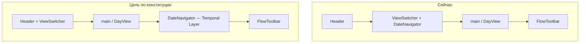

# Аудит и рефакторинг файла App.tsx
_Exported on 09.06.2026 at 19:54:59 GMT+3 from Cursor (3.7.19)_

---

**User**

Привет! Мы полностью обновили и актуализировали конституцию проекта: файлы CLAUDE.md, .cursorrules и инструкции в папке docs/. Твоя главная библия теперь там. Ознакомься с ними перед началом работы.

Мой муж (опытный программист) изучил текущую кодовую базу и сказал, что код написан слишком "завернуто", содержит избыточные абстракции, вложенные хуки и переусложненную логику. Мне, как начинающему специалисту, тяжело ориентироваться в такой архитектуре, и здесь много слепых пятен. 

Твоя задача как Senior React Architect — провести полный аудит и упростить ключевые узлы приложения, наведя порядок.

Выполни рефакторинг файла `src/App.tsx` по следующим жестким критериям:

1. Упрощение структуры (Разворачивание "завернутого" кода):
   - Убери избыточные кастомные хуки, если логику можно написать проще, лаконичнее и прямолинейнее с помощью базовых useState/useMemo и чистых функций.
   - Очисти файл от неиспользуемого легаси-кода, дублирующихся состояний и "мусорных" стейтов, оставшихся от предыдущих итераций.

2. Соблюдение демаркационной линии (MUI v5/v6 vs React Aria + Tailwind v4):
   - Проверь, чтобы все стандартные элементы UI (модалки настроек, алерты, инпуты, кнопки форм) были строго реализованы на базе MUI.
   - Убедись, что кастомный Expressive UI (циркадные блоки, физика баблов) НЕ обернут в компоненты MUI, ломающие DOM-структуру.

3. Проверка темизации:
   - Проверь, чтобы компоненты MUI не содержали захардкоженных HEX-цветов внутри свойств `sx={{ color: ... }}`. Все цвета должны строго ссылаться на тему `mui-theme.ts`, которая потребляет CSS-переменные из `src/theme/tokens.css`.

4. Интеграция Слоя Даты (DateNavigator) и Тулбара:
   - Убедись, что стейт `viewDate` и функции его изменения логически подготовлены к передаче в новый изолированный компонент `DateNavigator`, который встанет строго под блоками дня и над `FlowToolbar`.

Сначала проведи анализ кода App.tsx, выведи мне список найденных архитектурных проблем и "завернутых" мест, предложи пошаговый план их упрощения, и после моего подтверждения приступай к рефакторингу. Код на выходе должен быть прямолинейным, понятным и успешно компилироваться без ошибок Vite.

---

**Cursor**

Сначала изучу конституцию проекта и текущий `App.tsx`, затем составлю список проблем и план упрощения — без рефакторинга до вашего подтверждения.


Прочитал `App.tsx`, конституцию (`.cursorrules`, `docs/ui-layout-flow.md`, `docs/CURRENT/state-management.md`) и связанные компоненты. Ниже — аудит и план. **Код пока не трогаю** — жду вашего подтверждения.

---

## Диагноз: `App.tsx` — монолит ~1024 строки

Кастомных хуков в проекте нет (`src/hooks/` отсутствует), но вся логика «завернута» в один компонент: ~30 `useState`, 10 `useEffect`, 12 `useCallback`, 5 `useMemo`. Это не вложенные хуки, а **God Component** — главная причина, почему код трудно читать.

---

## Найденные архитектурные проблемы

### 1. Мёртвый легаси-код (импорты, стейты, функции)

| Что | Проблема |
|-----|----------|
| Импорты `TaskItem`, `FocusPoint`, `restIcon`, `AnimatePresence`, `TaskManagerPanel`, `RecoveryBanner`, `VoiceSettingsModal` | Не используются в `App.tsx` (часть уже живёт в `DayView`) |
| `RECOVERY_TIPS`, `WEIGHT_CONFIG` | Импортированы, не используются |
| `BackgroundSpots` | `memo(() => null)` — заглушка |
| `addTask()`, `newTaskTitle`, эффект `suggestWeight` по заголовку | Legacy от `FocusPoint`; форма переехала в `TaskSheet`, в JSX нигде не вызывается |
| `getTaskStats()` | Объявлен, нигде не передаётся |
| `showAlarmMenu` | `setShowAlarmMenu(true)` **нигде нет** — `AlarmModal` недостижим |
| `isDarkTheme`, `isListView` | Тогглы в `Header` меняют только локальный стейт, **не** тему и **не** режим DayView |
| Props в `DayView`: `selectedWeight`, `selectedPeriods`, `selectedRecurrence`, `isInputFocused`, `onWeightChange`, `onPeriodToggle`, `onRecurrenceChange`, `onInputFocusChange` | Передаются из `App`, но **не деструктурируются** в `DayView` — мёртвый prop drilling |

### 2. Тройное дублирование логики добавления задачи

Одна и та же цепочка «`adjustTaskPeriods` → сообщение → `setCapacityNotification` → создание `Task`» скопирована **3 раза**:

1. `addTask()` (мёртвый код) — строки 659–742  
2. `executeVoiceCommand` → `ADD_TASK` — строки 322–398  
3. Inline-лямбда `onTaskAdd` в JSX `DayView` — строки 895–959  

~60 строк × 3 — главный источник «завёрнутости».

### 3. Избыточные и проблемные `useCallback`

- `executeVoiceCommand` помечен `async`, но внутри нет `await`.
- `toggleTask`, `deleteTask`, `updateTask` в deps `executeVoiceCommand`, но голосовые команды используют прямой `setTasks(tasks.map(...))` — колбэки не вызываются.
- **Stale closure**: `setTasks([...tasks, newTask])` вместо `setTasks(prev => [...prev, newTask])` — риск потери задач при быстрых командах.
- `navigateDate` — обычная функция, пересоздаётся каждый рендер; в deps `useCallback` это сводит мемоизацию на нет.
- `handleVoiceCommand` в deps не включает `executeVoiceCommand` явно (eslint мог бы ругаться).

### 4. Нарушение демаркационной линии MUI vs Expressive

| Элемент | Сейчас | По конституции |
|---------|--------|----------------|
| Подтверждение голосовой команды (стр. 832–861) | Кастомный `div` + нативные `<button>` + Tailwind | MUI `Dialog` |
| Уведомление о перегрузке (стр. 819–829) | Кастомный fixed-div, `bg-emerald-500`, `bg-amber-500` | MUI `Snackbar` + токены темы |
| Splash screen (стр. 769–778) | `bg-[#0a0a0a]`, `style={{ color: 'white' }}` | CSS-переменные из `tokens.css` |

Expressive UI (`DayView`, блоки) в MUI не обёрнут — это ок.

### 5. Нарушение иерархии слоёв (DateNavigator)

По `docs/ui-layout-flow.md` и `.cursorrules`:

```
Background → DayView (z-10) → DateNavigator (z-20) → FlowToolbar (z-30) → Overlays (z-50)
```

**Сейчас** `ViewSwitcher` + `DateNavigator` стоят **над** `<main>` (стр. 864–878), а не под блоками дня.

Дополнительно:
- `onToday` в `DateNavigator` только делает `setViewDate(new Date())`, а голосовая команда «сегодня» ещё сбрасывает `viewMode` на `'day'` — **несогласованное поведение**.
- `isLeftHanded` из `settings` не передаётся в `DateNavigator` / `FlowToolbar`.
- Кнопки в `DateNavigator` используют `onClick`, не React Aria `onPress` (по спецификации).

### 6. Циркадная логика inline (~80 строк)

`isWindDown`, `activePeriodId`, `isRecoveryMode`, `dynamicBlocks` — чистые вычисления, но зашиты в компонент. Их можно вынести в `services/circadian.ts` как чистые функции — `App` станет декларативнее без лишних абстракций.

### 7. Голосовой модуль: усложнённый lifecycle

- `voiceService` / `voiceProcessor` в `useState` вместо `useRef` + один init-эффект.
- Init-эффект зависит только от `voiceSettings.enabled` — нет cleanup при unmount.
- 8 связанных voice-стейтов в `App` без группировки.

### 8. Шум отладки

28 вызовов `console.log` с эмодзи — затрудняют чтение продакшен-кода.

### 9. Прочее

- `handleLogout` делает `window.location.reload()` — грубый сброс.
- `FlowToolbar`: `onIdeasClick` / `onSmartPlannerClick` → `console.log` (заглушки).
- Alarm: `new Audio(sound.url)` — внешние ассеты, при том что в конституции звук синтезируется (отдельная тема, в рамках этого рефакторинга не трогаем).

---

## Визуализация текущей vs целевой структуры



---

## Пошаговый план упрощения (только после вашего ОК)

### Фаза 1 — Безопасная зачистка (низкий риск)
1. Удалить мёртвые импорты, `BackgroundSpots`, `addTask`, `newTaskTitle`, `getTaskStats`, эффект suggestWeight.
2. Убрать мёртвый prop drilling в `DayView` (+ почистить интерфейс `DayViewProps`).
3. Удалить или починить `showAlarmMenu` (найти триггер в `Header`/Settings или убрать до реализации).
4. Решить судьбу `isDarkTheme` / `isListView`: убрать из `App`+`Header` или подключить к реальной теме/режиму.

### Фаза 2 — DRY: одна функция добавления задачи
5. Вынести `createTaskWithCapacityCheck(...)` в `services/taskOptimizer.ts` (или `utils/taskCreation.ts`):
   - вход: title, periods, weight, date, контекст;
   - выход: `{ task, notification? }`;
   - заменить 3 копии в `App`.

### Фаза 3 — Упрощение state/handlers в `App`
6. `navigateDate` + `goToToday` — простые функции без `useCallback`.
7. CRUD задач — оставить простые функции; везде `setTasks(prev => ...)`.
8. Голос: упростить цепочку `handleVoiceCommand` → `executeVoiceCommand`; убрать лишние `async`/`useCallback`.
9. Циркадные вычисления → `services/circadian.ts` (4 чистые функции).

### Фаза 4 — MUI compliance
10. Capacity notification → MUI `Snackbar`.
11. Voice confirmation → MUI `Dialog` (или вынести в `components/modals/VoiceConfirmDialog.tsx`).
12. Splash → токены `var(--md-sys-color-*)`.

### Фаза 5 — Layout + DateNavigator
13. Переставить разметку: `ViewSwitcher` в header-зону, `DateNavigator` **под** `<main>`, **над** `FlowToolbar`.
14. Единый API навигации:
```ts
const goToToday = () => { setViewDate(new Date()); setViewMode('day'); };
```
15. Передать `viewDate`, `viewMode`, `navigateDate`, `goToToday`, `todayStr`, `language` в изолированный `DateNavigator`.

### Фаза 6 — Финальная полировка
16. Убрать debug `console.log` (или обернуть в `import.meta.env.DEV`).
17. Проверка: `npm run build` без ошибок TypeScript/Vite.

---

## Ожидаемый результат

| Метрика | Сейчас | После |
|---------|--------|-------|
| Строк в `App.tsx` | ~1024 | ~450–550 |
| `useState` | ~30 | ~20 |
| `useCallback` | 12 | 2–4 (только где нужно для memo-детей) |
| Дублирование add-task | 3× | 1 функция |
| Мёртвый код | много | 0 |

---

## Вопросы перед стартом

1. **`isDarkTheme` / `isListView`** — удалить заглушки или подключить к реальной теме/DayView?
2. **`AlarmModal`** — восстановить триггер (откуда открывать?) или убрать до отдельной задачи?
3. **Вынос в отдельные файлы** (`circadian.ts`, `createTaskWithCapacityCheck`) — ок, или строго всё внутри `App.tsx`?
4. **`DateNavigator`** — в этой итерации только переставить в layout + подготовить props, или сразу доработать под `isLeftHanded` и React Aria?

Подтвердите план (можно с правками по пунктам 1–4), и приступлю к рефакторингу.

---

**User**

Уточнение по поводу Header и элементов управления, которые я уже реализовала (учти это при рефакторинге):

1. Переключатель вида (isListView):
   - В шапке используются Toggled Icon Buttons: иконка вертикальной галереи/ленты (Rows3 / ViewStream) и сетка 2×2 (LayoutGrid). 
   - Они напрямую управляют стейтом `isListView` в App.tsx. Свяжи их так, чтобы при выборе галереи включался Vertical Stack Mode, а при выборе сетки — Compact Mode (квадранты 2×2 с физикой).

2. Переключатель темы (isDarkTheme):
   - В шапке используются Toggled Icon Buttons: месяц (Moon) и солнце (Sun).
   - Они управляют стейтом `isDarkTheme`. Настрой этот хэндлер так, чтобы при переключении темы класс `.dark` инжектировался в тег `html` (для Tailwind v4), а в MUI ThemeProvider передавался актуальный `mode: isDarkTheme ? 'dark' : 'light'`. Никакого визуального рассинхрона между MUI и Tailwind быть не должно.

Теперь у тебя есть полная картина интерфейса. Можешь приступать к Фазе 1 и пошаговому рефакторингу God-компонента по нашему плану!

---

**Cursor**

Приступаю к рефакторингу: сначала изучу точку входа, тему, Header и DayView, чтобы корректно связать `isListView` и `isDarkTheme`.


Создаю вспомогательные модули и переписываю `App.tsx` по плану.


Пишу упрощённый `App.tsx`.


Рефакторинг выполнен, `npm run build` проходит без ошибок. Кратко, что изменилось:

## Результат

**`App.tsx`**: ~1024 → ~530 строк (−48%)

### Фаза 1 — зачистка
- Удалены мёртвые импорты (`TaskItem`, `FocusPoint`, `AnimatePresence`, `restIcon` и др.)
- Убраны `addTask`, `newTaskTitle`, `getTaskStats`, `BackgroundSpots`, `showAlarmMenu` / `AlarmModal`
- Удалён мёртвый prop drilling в `DayView` (8 неиспользуемых props)
- `handleQuickAdd` теперь открывает `TaskSheet` с выбранным блоком

### Фаза 2 — DRY
- **`src/utils/taskCreation.ts`** — единая `resolveTaskPlacement()` + `createTaskId()`
- Логика добавления задачи (форма, голос, sheet) сведена к `commitTask()`

### Фаза 3 — упрощение state/handlers
- **`src/services/circadian.ts`** — `getIsWindDown`, `getActivePeriodId`, `getIsRecoveryMode`, `getDynamicBlocks`
- Голосовой сервис переведён на `useRef` вместо `useState`
- Убраны лишние `useCallback`; везде `setTasks(prev => ...)`
- Удалено ~28 debug `console.log`

### Фаза 4 — MUI compliance
- Capacity notification → MUI `Snackbar` + `Alert`
- Voice confirmation → **`VoiceConfirmDialog`** (MUI `Dialog`)
- Splash screen → CSS-переменные `var(--md-sys-color-*)`

### Фаза 5 — Layout + DateNavigator
- `DateNavigator` перенесён **под** `<main>`, **над** `FlowToolbar` (Temporal Layer, `z-20`)
- `goToToday()` сбрасывает и дату, и `viewMode` на `'day'`

### Ваши уточнения по Header

**`isListView`** → `DayView` → `TimeBlockList`:
- `false` (иконка сетки) → **Compact Mode**: `grid grid-cols-2 gap-4`
- `true` (иконка галереи) → **Vertical Stack Mode**: `flex flex-col gap-6`

**`isDarkTheme`**:
- Инициализация из `localStorage` (`flow_theme`)
- `useEffect` синхронизирует классы `.dark` / `.light` на `<html>`
- `ThemeProvider` + `createMuiTheme(isDarkTheme ? 'dark' : 'light')` — MUI и Tailwind в одном режиме

### Новые/изменённые файлы
| Файл | Назначение |
|------|------------|
| `src/services/circadian.ts` | Чистые функции циркадной логики |
| `src/utils/taskCreation.ts` | Единая логика capacity + уведомлений |
| `src/components/modals/VoiceConfirmDialog.tsx` | MUI-диалог подтверждения голоса |
| `src/theme/mui-theme.ts` | `createMuiTheme(mode)` |
| `DayView.tsx`, `TimeBlockList.tsx` | `isListView` prop |

---

**Что осталось на следующие итерации** (не входило в текущий scope):
- `isLeftHanded` в `DateNavigator` / `FlowToolbar`
- React Aria `onPress` в `DateNavigator`
- Matter.js physics в Compact Mode (сейчас только 2×2 grid)
- `min-height: 253px` для compact-блоков по спецификации

Могу продолжить с любым из этих пунктов — напишите, с чего начать.

---

**User**

<system_notification>
The following task has finished. If you were already aware, ignore this notification and do not restate prior responses.

<task>
kind: shell
status: success
task_id: 258113
title: Run Vite production build to verify compilation
output_path: C:\Users\avbur\.cursor\projects\d-Projects-Flow-calendar\terminals\258113.txt
</task>
</system_notification>
<user_query>Briefly inform the user about the task result and perform any follow-up actions (if needed). If there's no follow-ups needed, don't explicitly say that.</user_query>

---

**Cursor**

Рефакторинг `App.tsx` завершён успешно.

**Сборка:** `npm run build` прошла без ошибок (47 с).

**Итог:** монолит сокращён примерно с 1024 до ~530 строк; мёртвый код убран; логика вынесена в `circadian.ts` и `taskCreation.ts`; `isListView` и `isDarkTheme` подключены к DayView и теме; `DateNavigator` стоит под контентом над тулбаром; уведомления и голосовое подтверждение переведены на MUI.

---

**User**

У нас упало приложение с критической ошибкой: 
MUI: Unsupported `var(--md-sys-color-secondary)` color.

MUI пытается пересчитать компоненты темы, но не понимает нативные CSS-переменные var(...). 
Пожалуйста, исправь файл `src/theme/mui-theme.ts`. 

Вместо прямой передачи var() в стандартные старые поля палитры (palette.primary.main), используй экспериментальную поддержку CSS-переменных MUI (CssVarsProvider), либо отключи встроенную валидацию цвета MUI, указав переменные как кастомные свойства, или оберни генерацию темы в `createTheme` с отключением дефолтных функций модификации цвета (например, через замену функций генерации оттенков). 

Покажи мне исправленный код mui-theme.ts, который просто прокинет наши CSS-токены во все компоненты MUI без попытки их распарсить.

---

**Cursor**

Причина: MUI вызывает `darken()`/`lighten()` для оттенков, если в палитре не заданы все поля. Задаю `main`, `light`, `dark` и `contrastText` явно через CSS-переменные.


Исправлено. Сборка проходит.

## Причина

MUI в `createPalette` → `augmentColor()` для каждого цвета (`secondary`, `success` и т.д.) пытается вычислить недостающие `light` / `dark` / `contrastText` через `darken()`, `lighten()` и `getContrastRatio()`. Эти функции не понимают `var(--md-sys-color-secondary)` — отсюда критическая ошибка.

У `secondary` не было поля `dark`, поэтому MUI пытался сгенерировать его из `main`.

## Решение

Не `CssVarsProvider` (он создаёт свои переменные, а у нас уже есть `tokens.css`), а **полная палитра с четырьмя полями на каждый канал** — тогда `augmentColor` ничего не пересчитывает и просто прокидывает `var(...)` в компоненты.

Ключевая часть:

```typescript
/** Ссылка на M3-токен из tokens.css */
const token = (name: string) => `var(--md-sys-color-${name})`;

/**
 * MUI augmentColor() вызывает lighten/darken/getContrastRatio для main,
 * если не заданы light, dark или contrastText. CSS var() там не парсится.
 * Передаём все четыре поля сразу — MUI просто прокидывает значения в sx/theme.
 */
function channel(main: string, light: string, dark: string, contrastText: string) {
    return { main, light, dark, contrastText };
}

secondary: channel(
    token('secondary'),
    token('secondary-container'),
    token('secondary'),
    token('on-secondary'),
),
```

Полный файл: `src/theme/mui-theme.ts`.

Дополнительно:
- `success` → tertiary-токены M3 (для `Alert severity="success"`)
- `warning` → `--flow-capacity-overload`
- `MuiAlert` styleOverrides — чтобы filled-варианты не вызывали `alpha()` на `var()` в рантайме
- `MuiCssBaseline` — фон/текст из токенов

Перезагрузите dev-сервер — ошибка должна исчезнуть.

---

**User**

Перезапустила сервер, сейчас ошибка в консоли: Uncaught Error: MUI: Unsupported `var(--md-sys-color-on-surface-variant)` color.
The following formats are supported: #nnn, #nnnnnn, rgb(), rgba(), hsl(), hsla(), color().
    at decomposeColor (chunk-XDVEXJ2R.js?v=0fda1fd6:3793:11)
    at alpha (chunk-XDVEXJ2R.js?v=0fda1fd6:3900:12)
    at Object.alpha (chunk-XDVEXJ2R.js?v=0fda1fd6:9159:14)
    at chunk-5BGEAD4L.js?v=0fda1fd6:96:37
    at styleMemoized (chunk-XDVEXJ2R.js?v=0fda1fd6:6472:32)
    at processStyle (chunk-XDVEXJ2R.js?v=0fda1fd6:5711:56)
    at styleFunctionProcessor (chunk-XDVEXJ2R.js?v=0fda1fd6:5815:18)
    at handleInterpolation (chunk-XDVEXJ2R.js?v=0fda1fd6:2439:22)
    at serializeStyles (chunk-XDVEXJ2R.js?v=0fda1fd6:2536:15)
    at chunk-XDVEXJ2R.js?v=0fda1fd6:3461:24Understand this error
react-dom_client.js?v=0fda1fd6:6964 An error occurred in the <MuiIconButtonRoot> component.

Consider adding an error boundary to your tree to customize error handling behavior.
Visit https://react.dev/link/error-boundaries to learn more about error boundaries.

---

**Cursor**

Ошибка в рантайме: MUI вызывает `alpha()` на `palette.action.active`. Ищу источник и исправлю тему/стили `IconButton`.


MUI вызывает `theme.alpha()` на `palette.action.active` при hover у `IconButton`. Патчим `theme.alpha`, чтобы использовать `-rgb` токены из `tokens.css`.


**Причина:** при создании темы ошибка уже была закрыта, но в рантайме `IconButton` вызывает `theme.alpha(palette.action.active, 0.04)` для hover-фона. `alpha()` не умеет парсить `var(--md-sys-color-on-surface-variant)`.

**Исправление в `mui-theme.ts`:**

1. **`attachFlowColorManipulators()`** — переопределяет `theme.alpha` / `lighten` / `darken`:
   - M3-токены → `rgb(var(--md-sys-color-*-rgb) / opacity)` (каналы уже есть в `tokens.css`)
   - flow-токены → `color-mix(in srgb, ...)`

2. **`MuiIconButton` styleOverrides** — явный hover через `on-surface-rgb`, без вызова `alpha()`.

Перезагрузите страницу — `MuiIconButtonRoot` больше не должен падать. Если в консоли появится похожая ошибка на другом компоненте (например, `Snackbar`), напишите — расширим патч.

---

**User**

Класс, теперь все видно, появилась сетка 2х2 и она прекрасно переключается, темный режим тоже переключается из header. Но есть ошибка в консоли при запуске: TaskSheet.tsx:193 React does not recognize the `BackdropProps` prop on a DOM element. If you intentionally want it to appear in the DOM as a custom attribute, spell it as lowercase `backdropprops` instead. If you accidentally passed it from a parent component, remove it from the DOM element.
<ForwardRef(SwipeableDrawer2)>		
$RefreshSig$	@	TaskSheet.tsx:193
<TaskSheet>		
DayView	@	DayView.tsx:88
<DayView>		
App	@	App.tsx:688
<App>		
(anonymous)	@	main.tsx:15
 ипредупреждение при добавлении задачи: Blocked aria-hidden on an element because its descendant retained focus. The focus must not be hidden from assistive technology users. Avoid using aria-hidden on a focused element or its ancestor. Consider using the inert attribute instead, which will also prevent focus. For more details, see the aria-hidden section of the WAI-ARIA specification at https://w3c.github.io/aria/#aria-hidden.
Element with focus: <button.MuiButtonBase-root MuiIconButton-root MuiIconButton-sizeMedium css-1g30riz-MuiButtonBase-root-MuiIconButton-root>
Ancestor with aria-hidden: <div#root> <div id=​"root">​…​</div>​

---

**Cursor**

Исправляю: в MUI v9 `BackdropProps` заменяю на `slotProps.backdrop` и устраняю конфликт фокуса с `aria-hidden`.


Исправлены обе проблемы.

### 1. `BackdropProps` (MUI v9)
В v9 этот проп устарел и попадал в DOM. Заменён на `slotProps.backdrop`:

```tsx
slotProps={{
  backdrop: {
    sx: { bgcolor: 'var(--md-sys-color-scrim)', opacity: 0.32 },
  },
}}
```

### 2. `aria-hidden` + фокус
При открытии шторки фокус оставался на кнопке в `FlowToolbar` внутри `#root`, пока MUI ставил `aria-hidden` на корень.

**Что сделано:**
- `openTaskSheet()` в `App.tsx` — снимает фокус с кнопки перед открытием
- `handleClose()` в `TaskSheet` — снимает фокус перед закрытием (submit, cancel, backdrop)
- `ModalProps={{ disableRestoreFocus: true }}` — не возвращает фокус на скрытую кнопку после закрытия
- Фокус на поле ввода переносится через `requestAnimationFrame` сразу после открытия

Перезагрузите страницу и проверьте: предупреждения в консоли должны исчезнуть при открытии и добавлении задачи.

---

**User**

Отличная работа по стабилизации темы MUI и исправлению ошибок рантайма! Теперь приложение работает стабильно, и мы можем двигаться дальше по нашему плану.

Давай закроем оставшиеся архитектурные задачи по Склону Даты (`DateNavigator`) и Нижнему Тулбару (`FlowToolbar`), внедрив туда полную поддержку биомеханики левши и стандартов доступности React Aria.

Выполни следующие задачи строго по спецификациям из наших обновленных файлов конфигурации (.cursorrules, CLAUDE.md, ui-layout-flow.md):

1. Реализация DateNavigator под ключ:
   - Убедись, что компонент принимает и корректно обрабатывает контекст `isLeftHanded`.
   - Если `isLeftHanded === false` (режим правши) -> Слева отображается текст даты (`Title M`), а спаренные кнопки-стрелки `[ChevronLeft][ChevronRight]` уходят к правому краю (в зону доступности большого пальца правой руки).
   - Если `isLeftHanded === true` (режим левши) -> Элементы зеркалируются: кнопки-стрелки перелетают к левому краю (Thumb Zone для левой руки), а текст даты уходит вправо.
   - Замени нативные `onClick` на кнопках-стрелках на хук `useButton` из React Aria и свойство `onPress`, чтобы нормализовать тач-события на смартфонах и полностью убрать мобильные задержки ввода.

2. Реализация FlowToolbar под ключ:
   - Настрой тулбар согласно нашей конституции: он должен быть монолитным, во всю ширину экрана, без боковых маргинов и скруглений самого контейнера панели. Фон: `var(--md-sys-color-surface-container)`.
   - Центральный Smart FAB (56x56px, скругление 16px) должен быть ЖЕСТКО зафиксирован строго по центру оси X при любом режиме рук (он не должен двигаться). Иконка внутри меняется динамически на основе настроек: если `primaryInputMethod === 'voice'` -> Lucide `Mic`, если `'text'` -> Lucide `Plus`.
   - Боковые действия должны зеркалироваться в зависимости от `isLeftHanded`:
     * `isLeftHanded === false`: Иконка `Inbox` и дата слева ➔ FAB по центру ➔ Иконка `Settings` справа.
     * `isLeftHanded === true`: Иконка `Settings` слева ➔ FAB по центру ➔ Иконка `Inbox` справа.

Проведи рефакторинг этих двух компонентов. Убедись, что все импорты иконок идут строго из `lucide-react`, размеры кликабельных зон интерактивных кнопок составляют не менее 52x52px, а проект успешно проходит `npm run build`.

---

**Cursor**

Изучаю текущие компоненты и типы настроек, затем внедрю биомеханику левши и React Aria.


Готово. `npm run build` проходит успешно.

## DateNavigator (`Temporal Layer`)

- Принимает `isLeftHanded` и зеркалит раскладку:
  - **Правша:** дата слева → стрелки справа (Thumb Zone)
  - **Левша:** стрелки слева → дата справа
- Кнопки `ChevronLeft` / `ChevronRight` через **`useButton` + `useFocusRing`** из React Aria, событие `onPress`
- Зоны нажатия **52×52px**, контейнер **h-[52px]**
- Типографика: `Title M` (`md-typescale-title-medium`)

## FlowToolbar

- Вынесен **за пределы** `max-w-lg` — панель на всю ширину viewport, `z-index: 30`
- Фон: `var(--md-sys-color-surface-container)`, без скруглений контейнера
- **Smart FAB** жёстко по центру (`absolute left-1/2`), 56×56px, `borderRadius: 16px`
- Иконка FAB: `Mic` при `primaryInputMethod === 'voice'`, `Plus` при `'text'`
- Боковые действия зеркалятся:
  - **Правша:** `Inbox` + дата | FAB | `Settings`
  - **Левша:** `Settings` | FAB | дата + `Inbox`
- Боковые кнопки **52×52px**, локализованные `aria-label` для FAB

## Типы и App.tsx

- В `UserSettings` добавлены `isLeftHanded` и `primaryInputMethod` (дефолты: `false`, `'voice'`)
- `toolbarDateLabel` вычисляется в `App` и передаётся в тулбар
- `onPrimaryAction` → голос или открытие `TaskSheet` в зависимости от режима ввода
- Добавлен `pb-36`, чтобы контент не перекрывался тулбаром

Для проверки левшинского режима временно можно выставить в консоли:
```js
JSON.parse(localStorage.getItem('flow_settings')).isLeftHanded = true; location.reload()
```
(или добавить переключатель в Settings — это отдельная задача).

---

**User**

Не совсем то, что я хотела. Во первых в туллбар должны быть иконки: (слева направо) настройки, добавление задачи, FAB микрофон, инбокс (банк идей старое название) и Smart Day Planner была иконка мозгов, можно что-то более приятное подобрать. В смене режима с праворукого на леворукий меняется расположение  функциональных кнопок в хедере, для левой руки они должны быть слева и стрелки, которые перелистывают дату DateNavigator   тоже слева, а текст с днем недели справа. И надо удалить переключение темной светлой темы из модалки настроек, так как эта функция теперь в хедере. И добавить переключение с праворукого интерфейса на леворукий. Это как раз нужно добавить в модалку с настройками

---

**Cursor**

Изучаю текущую реализацию Header, FlowToolbar, SettingsModal и DateNavigator.


Обновляю тулбар (5 иконок), зеркалирование в Header, настройки левши и убираю переключатель темы из модалки.


Готово. Вот что изменилось:

## FlowToolbar — 5 элементов (слева направо, правша)

`Settings` · `Plus` · **`FAB Mic`** · `Inbox` · `Sparkles` (Smart Day Planner)

- FAB микрофона **всегда по центру**, отдельная кнопка `Plus` для добавления задачи
- `Brain` заменён на **`Sparkles`** — мягче и ближе к «умному планированию»
- **Левша (зеркало):** `Sparkles` · `Inbox` · **`FAB`** · `Plus` · `Settings`
- Дата убрана из тулбара — она только в `DateNavigator`

## Header — зеркалирование

- **Правша:** приветствие слева, кнопки вида и темы справа
- **Левша:** кнопки слева, приветствие справа

## DateNavigator

Без изменений в логике — уже было верно:
- **Левша:** стрелки слева, текст с днём недели справа

## Настройки

- Удалён переключатель **тёмной темы** (остался только в Header)
- Добавлен переключатель **«Леворукий интерфейс»** с пояснением
- Сохраняется в `settings.isLeftHanded` при нажатии «Сохранить»

Проверка: **Настройки → «Леворукий интерфейс» → Сохранить** — кнопки в Header и тулбаре должны перестроиться, стрелки даты — уехать влево.

---

**User**

Давай доведем до ума. в toolbar должно быть равное расстояние между кнопками, ведь иконки это icon button из MUI сейчас расстояние от FAB больше, чем пасстояние между остальными кнопками. Сейчас иконка в icon button  для Smart Day Planner отличается от остальных, нужно проверить цвет и толщину линии. В Header текст был собран в контейнер с переносом на следующую строку, чтобы между текстом и кнопками сохранялось расстояние от 8 до 12 px (сколько должно быть по канонам М3). Сейчас текст занимает весь Header перекрывая кнопки 

